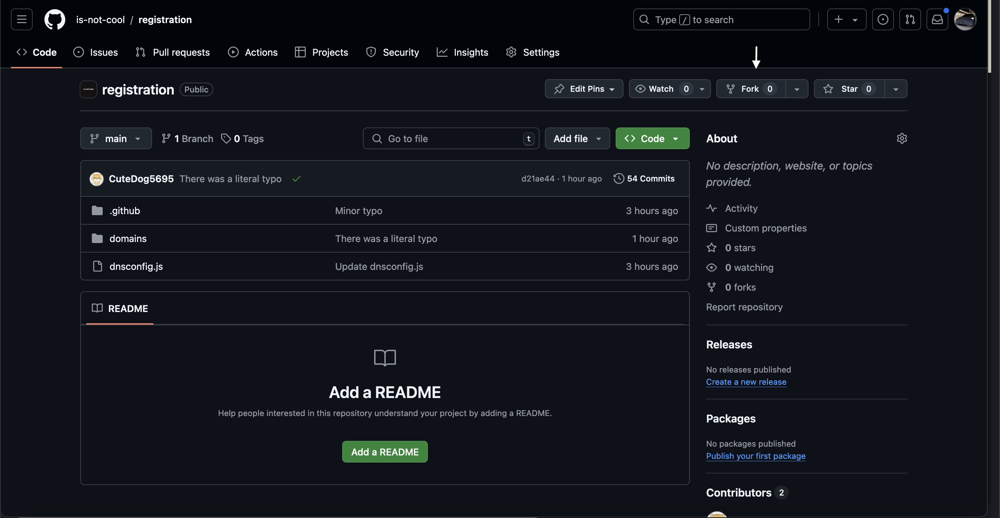

# 🏃‍♂️ quickstart

<figure><figcaption></figcaption></figure>

first, fork the repository as shown in the photo above this text.


want to learn how to make your own? buy ur own domain&#x20;


### setting up

to set up, you will need to make a json file in the "domains" folder, you will need to make sure it follows this format in json and goes like "yoursubdomain".is-not.cool.json

```
{
    "description": "insert ur description",

    "domain": "is-not.cool",
    "subdomain": "yoursubdomain",

    "owner": {
        "repo": "https://github.com/is-not-cool/registration",
        "email": "ur email adress"
    },

    "records": {
        "A": ["1.1.1.1", "1.0.0.1"],
        "AAAA": ["2606:4700:4700::1111", "2606:4700:4700::1001"],
        "CNAME": "example.com",
        "MX": ["mx1.example.com", "mx2.example.com"],
        "TXT": ["example_verification=1234567890"],
        "NS": ["ns1.example.com", "ns2.example.com"],
        "SRV": [
            { "priority": 10, "weight": 60, "port": 5060, "target": "sipserver.example.com" },
            { "priority": 20, "weight": 10, "port": 5061, "target": "sipbackup.example.com" }
        ]
    },

    "proxied": false
}
```

Only select the records you need, this is just a example on what all the records we support should be.

