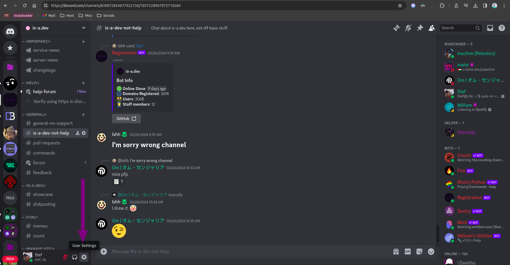
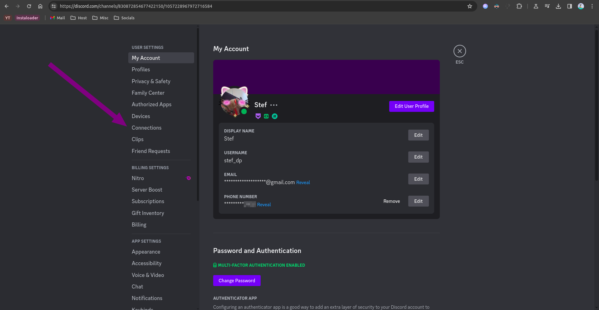
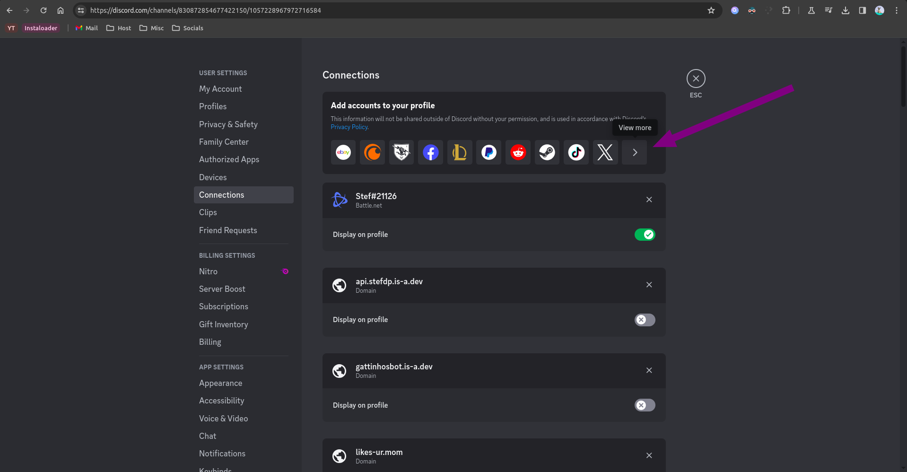
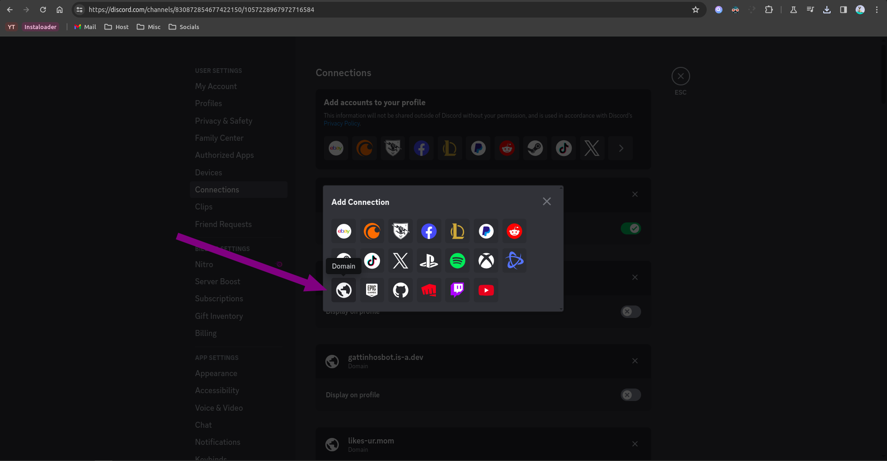
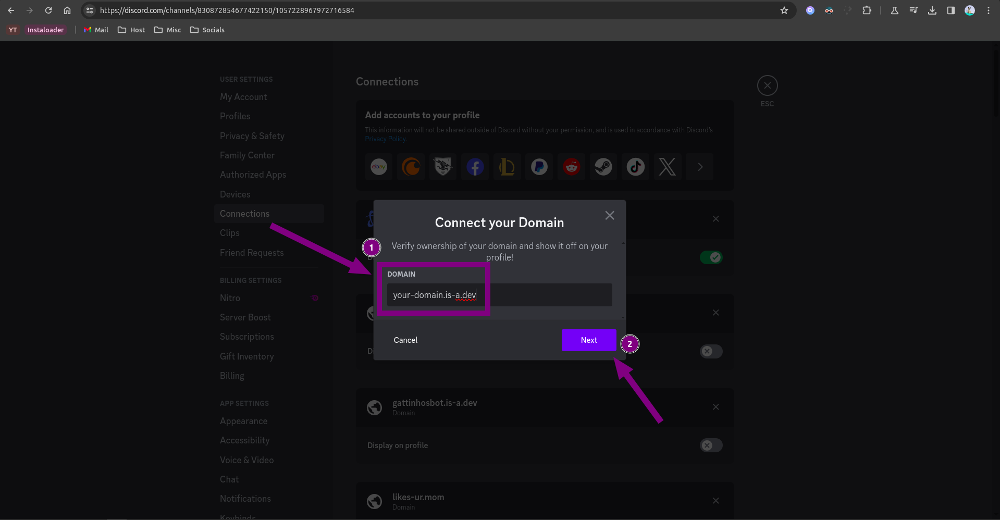
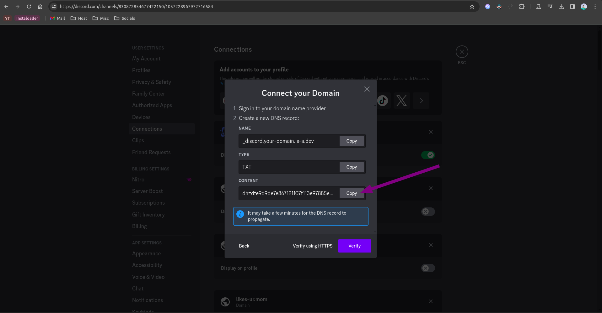

# Setting up Discord domain connection with your is-a.dev domain

## Get your verification string

1. Open your Discord app and press `Settings`.


1. Open the `Connections` section.


1. Press the `View more` button.


1. Click on the domain button (the globe icon).


1. In the field that appears type your is-a.dev domain name (e.g. `example.is-a.dev`).


1. Copy the verification string.


### Create the domain file

Create a JSON file inside the `domains/` directory called `domains/_discord.example.json` with the following content:

```json 
{
    "owner": {
        "username": "github-username",
        "email": "email@address"
    },
    "record": {
        "TXT": "discord-verification-string"
    }
} 
```

## Configuration
After your pull request has been merged, repeat the steps to get the verification string and press the `Verify` button.
If it shows any error such as `Unable to verify your domain`, try waiting a few minutes (sometimes up to 24 hours) as the DNS might have not been updated yet.